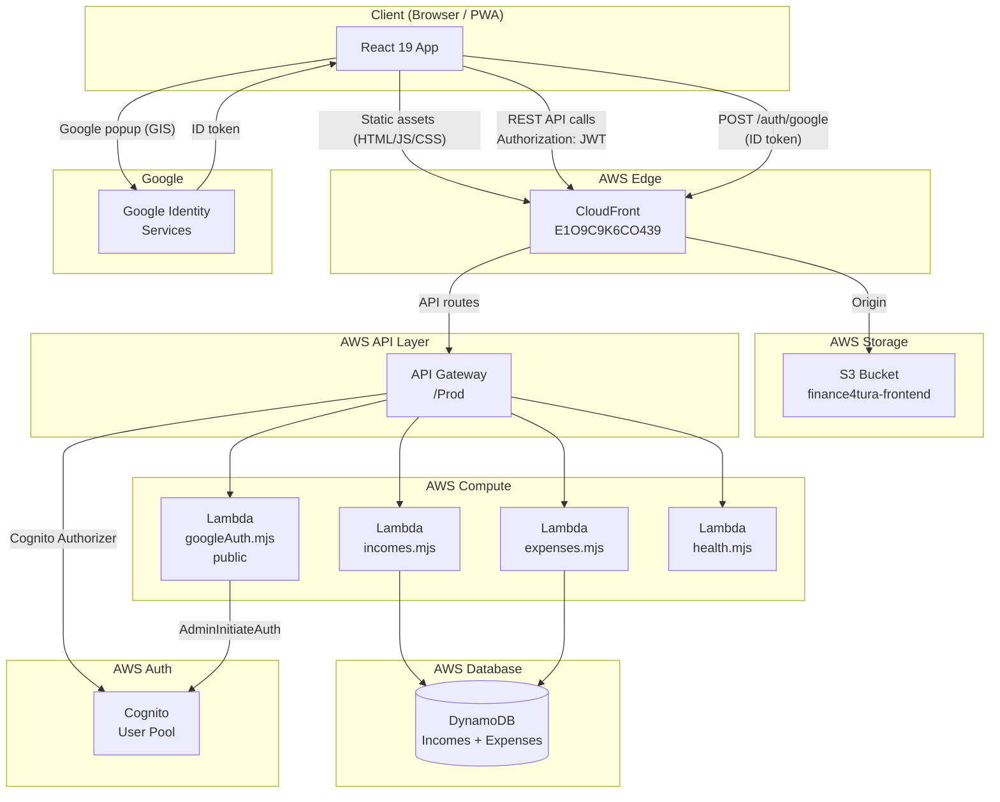
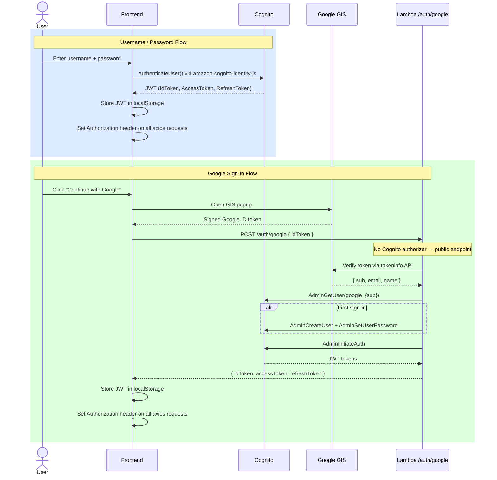
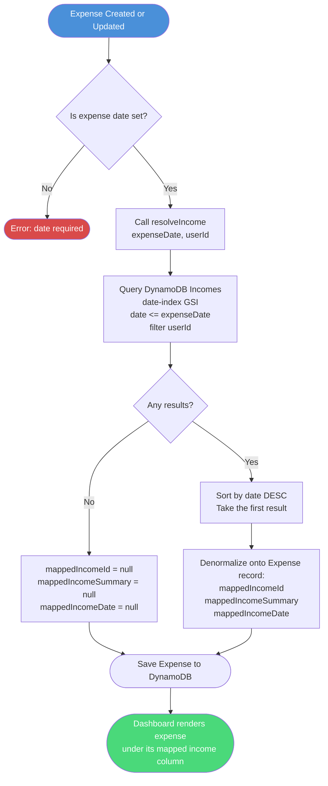
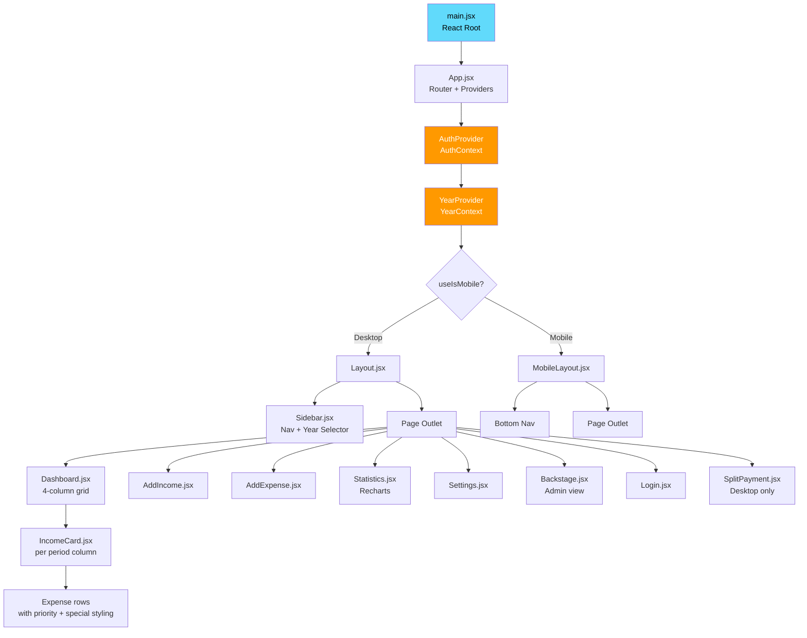
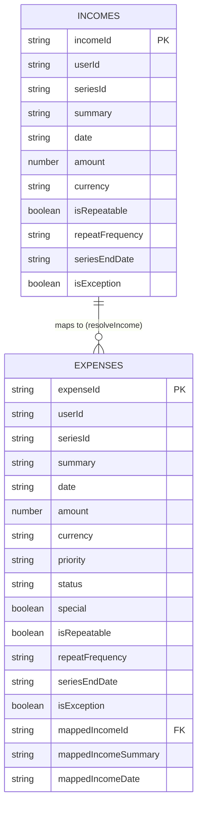
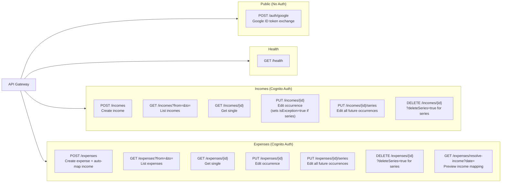

# Finance4Tura

> **Personal budgeting web app** — incomes are received periodically; expenses automatically map to the most recent income before their date. The dashboard shows income-period columns, each with its associated expenses and a summary footer.

[](https://d34ylrmixnmvem.cloudfront.net)
[](https://2t55twyqmh.execute-api.eu-central-1.amazonaws.com/Prod/health)
[](https://nodejs.org)
[](https://react.dev)
[](https://web.dev/progressive-web-apps/)

**Production URL:** https://d34ylrmixnmvem.cloudfront.net

---

## Table of Contents

1. [Project Overview](#1-project-overview)
2. [Quick Start — Local Development](#2-quick-start--local-development)
3. [Development Commands](#3-development-commands)
4. [System Architecture](#4-system-architecture)
5. [Authentication Flow](#5-authentication-flow)
6. [Income Mapping Logic](#6-income-mapping-logic)
7. [Frontend Component Tree](#7-frontend-component-tree)
8. [Data Model](#8-data-model)
9. [API Routes](#9-api-routes)
10. [Full API Reference](#10-full-api-reference)
11. [Environment Variables](#11-environment-variables)
12. [AWS Infrastructure](#12-aws-infrastructure)
13. [File Structure](#13-file-structure)
14. [Design Decisions](#14-design-decisions)
15. [Version History](#15-version-history)

---

## 1. Project Overview

Finance4Tura is a single-user personal finance tracker built around a simple mental model: **income defines a period, and every expense belongs to the period opened by the most recent income before it.**

### Core Concepts

| Concept | Description |
|---|---|
| **Income period** | Every income record opens a new budget period. Expenses that fall between two income dates belong to the earlier income. |
| **Auto-mapping** | When an expense is created, `resolveIncome` queries DynamoDB for the latest income whose `date <= expenseDate` and denormalizes its ID/summary/date onto the expense record. |
| **Repeating events** | Both incomes and expenses support daily/weekly/monthly recurrence. Occurrences are expanded into individual DynamoDB records at creation time and linked by a `seriesId`. |
| **Series editing** | Editing a single occurrence sets `isException: true` on that record only, leaving other occurrences untouched. The `/series` endpoint updates all future occurrences. |
| **Special expenses** | An expense can be flagged as `special: true`, which renders it with a star icon and red row background on the Dashboard. |
| **Dashboard columns** | Desktop shows 4 income-period columns side by side. Mobile shows 1 column at a time with swipe navigation. A year selector in the top bar filters the view. |
| **Split Payments** | A desktop-only utility module (`/split-payments`) for splitting costs between people. Data stored in `localStorage` — no backend required. |

### Tech Stack

| Layer | Technology |
|---|---|
| Frontend | React 19, Vite, Recharts, Day.js, Axios, PWA (vite-plugin-pwa) |
| Backend | AWS SAM, Node.js 20, AWS Lambda |
| Database | AWS DynamoDB (DynamoDB Local via Docker for development) |
| Auth | AWS Cognito User Pool + Google Identity Services (GIS) |
| Hosting | S3 (frontend assets) + CloudFront CDN |
| IaC | AWS SAM / CloudFormation (`backend/template.yaml`) |

---

## 2. Quick Start — Local Development

### Prerequisites

- Node.js 18+
- Docker + Docker Compose
- [AWS SAM CLI](https://docs.aws.amazon.com/serverless-application-model/latest/developerguide/install-sam-cli.html)
- AWS CLI configured (for DynamoDB Local health checks)

### Step 1 — Start DynamoDB Local

```bash
cd docker
docker compose up -d

# Verify running:
aws dynamodb list-tables --endpoint-url http://localhost:8000

# Bootstrap tables (first time only):
./init-tables.sh
```

### Step 2 — Start the Backend API

```bash
cd backend
sam build --no-cached
sam local start-api    # API Gateway on http://localhost:3001

# Smoke test:
curl http://localhost:3001/health
```

> **Note:** `sam local start-api` does not enforce the Cognito authorizer. Lambda falls back to `userId = "local-dev"`.

### Step 3 — Start the Frontend

```bash
cd frontend
npm install
npm run dev    # Vite dev server on http://localhost:5173
```

Open [http://localhost:5173](http://localhost:5173). Sign in with the Demo account (`demo` / `Demo12`), create a new account, or use **Continue with Google**.

---

## 3. Development Commands

| Task | Command |
|---|---|
| Start DynamoDB Local | `cd docker && docker compose up -d` |
| Bootstrap tables (first run) | `cd docker && ./init-tables.sh` |
| Build backend | `cd backend && sam build --no-cached` |
| Start API locally | `cd backend && sam local start-api` |
| Run backend tests | `cd backend && npm test` |
| Deploy backend to AWS | `cd backend && sam build --no-cached && sam deploy` |
| Start frontend dev server | `cd frontend && npm run dev` |
| Lint frontend | `cd frontend && npm run lint` |
| Run frontend tests | `cd frontend && npm test` |
| Build frontend | `cd frontend && npm run build` |
| Deploy frontend to S3 | `cd frontend && npm run build && aws s3 sync dist s3://finance4tura-frontend --region eu-central-1 --delete` |
| Invalidate CloudFront cache | `aws cloudfront create-invalidation --distribution-id E1O9C9K6CO439 --paths "/*" --region us-east-1` |

### Full Frontend Deploy (copy-paste)

```bash
cd frontend && npm run build
aws s3 sync dist s3://finance4tura-frontend --region eu-central-1 --delete
aws cloudfront create-invalidation --distribution-id E1O9C9K6CO439 --paths "/*" --region us-east-1
```

---

## 4. System Architecture



---

## 5. Authentication Flow



---

## 6. Income Mapping Logic



---

## 7. Frontend Component Tree



---

## 8. Data Model



**GSI:** Both tables have a `date-index` Global Secondary Index on the `date` attribute, enabling efficient range queries by date.

**Field notes:**
- `repeatFrequency`: `daily` | `weekly` | `monthly`
- `priority`: `High` | `Medium` | `Low`
- `status`: `Pending` | `Completed`
- `special`: `true` renders the expense with a star icon and red row background on the Dashboard
- `isException`: `true` when a single series occurrence has been individually edited

---

## 9. API Routes



---

## 10. Full API Reference

**Base URL (production):** `https://2t55twyqmh.execute-api.eu-central-1.amazonaws.com/Prod`
**Base URL (local):** `http://localhost:3001`

All protected endpoints require `Authorization: <Cognito IdToken>` header.

### Auth

| Method | Path | Auth | Description |
|---|---|---|---|
| `POST` | `/auth/google` | None | Exchange Google ID token for Cognito JWT. Body: `{ idToken }`. Returns `{ idToken, accessToken, refreshToken }`. |

### Health

| Method | Path | Auth | Description |
|---|---|---|---|
| `GET` | `/health` | Cognito | Returns `{ status: "ok" }`. |

### Incomes

| Method | Path | Auth | Description |
|---|---|---|---|
| `POST` | `/incomes` | Cognito | Create income. If `isRepeatable: true`, expands all occurrences into individual records sharing a `seriesId`. |
| `GET` | `/incomes` | Cognito | List incomes for the authenticated user. Optional `?from=YYYY-MM-DD&to=YYYY-MM-DD`. |
| `GET` | `/incomes/{incomeId}` | Cognito | Fetch a single income by ID. |
| `PUT` | `/incomes/{incomeId}` | Cognito | Edit a single occurrence. If part of a series, sets `isException: true` on this record. |
| `PUT` | `/incomes/{incomeId}/series` | Cognito | Edit this record and all future occurrences in the same series. |
| `DELETE` | `/incomes/{incomeId}` | Cognito | Delete a single income. Append `?deleteSeries=true` to delete all records sharing the same `seriesId`. |

### Expenses

| Method | Path | Auth | Description |
|---|---|---|---|
| `POST` | `/expenses` | Cognito | Create expense. Calls `resolveIncome` to auto-map `mappedIncomeId`. Expands recurring occurrences if `isRepeatable: true`. |
| `GET` | `/expenses` | Cognito | List expenses for the authenticated user. Optional `?from=YYYY-MM-DD&to=YYYY-MM-DD`. |
| `GET` | `/expenses/{expenseId}` | Cognito | Fetch a single expense by ID. |
| `PUT` | `/expenses/{expenseId}` | Cognito | Edit a single occurrence. Re-runs `resolveIncome` if the date changes. |
| `PUT` | `/expenses/{expenseId}/series` | Cognito | Edit this record and all future occurrences in the same series. |
| `DELETE` | `/expenses/{expenseId}` | Cognito | Delete a single expense. Append `?deleteSeries=true` to delete all records sharing the same `seriesId`. |
| `GET` | `/expenses/resolve-income` | Cognito | Preview income mapping for a given date. Query param: `?date=YYYY-MM-DD`. Returns the matched income or `null`. |

---

## 11. Environment Variables

### Frontend

Create `frontend/.env.local` for local development and `frontend/.env.production` for cloud builds.

| Variable | Local value | Production value |
|---|---|---|
| `VITE_API_BASE_URL` | `http://localhost:3001` | `https://2t55twyqmh.execute-api.eu-central-1.amazonaws.com/Prod` |
| `VITE_COGNITO_USER_POOL_ID` | `eu-central-1_CD7AdBFwQ` | `eu-central-1_CD7AdBFwQ` |
| `VITE_COGNITO_CLIENT_ID` | `2nh5dljhrg9mq7nsmdg7cef21v` | `2nh5dljhrg9mq7nsmdg7cef21v` |
| `VITE_COGNITO_REGION` | `eu-central-1` | `eu-central-1` |
| `VITE_GOOGLE_CLIENT_ID` | Google OAuth Client ID | Google OAuth Client ID |

> **Vite requirement:** `vite.config.js` must include `define: { global: 'globalThis' }` for `amazon-cognito-identity-js` to work in the browser bundle.

### Backend

Lambda environment variables are defined in `backend/template.yaml`.

| Variable | Description |
|---|---|
| `DYNAMODB_ENDPOINT` | Override DynamoDB endpoint. Set to `http://host.docker.internal:8000` for local dev. Omit in production (uses real AWS DynamoDB). |
| `GOOGLE_CLIENT_ID` | Google OAuth Client ID used by `googleAuth.mjs` to verify ID tokens. |

---

## 12. AWS Infrastructure

| Resource | Value |
|---|---|
| CloudFormation stack | `finance4tura-backend` |
| API Gateway URL | `https://2t55twyqmh.execute-api.eu-central-1.amazonaws.com/Prod` |
| S3 bucket (frontend) | `finance4tura-frontend` |
| CloudFront distribution ID | `E1O9C9K6CO439` |
| CloudFront domain | `d34ylrmixnmvem.cloudfront.net` |
| Cognito User Pool ID | `eu-central-1_CD7AdBFwQ` |
| Cognito App Client ID | `2nh5dljhrg9mq7nsmdg7cef21v` |
| AWS Region | `eu-central-1` |

### samconfig.toml — Required Structure

```toml
[default.deploy.parameters]
region = "eu-central-1"
capabilities = "CAPABILITY_IAM"
resolve_s3 = true
confirm_changeset = false
```

> The stack name **must** be `finance4tura-backend`. `capabilities` and `resolve_s3` belong under `[default.deploy.parameters]`, not under `[default.deploy.guided]`.

### Cache-Control Note

All Lambda responses include `"Cache-Control": "no-store"` in CORS headers. This prevents API Gateway's internal CloudFront layer from caching empty or stale API responses.

---

## 13. File Structure

```
finance4tura/
├── frontend/
│   ├── public/                    # Static assets, PWA icons
│   ├── src/
│   │   ├── api/
│   │   │   ├── client.js          # Axios instance + auth interceptor + opLog
│   │   │   ├── incomes.js         # Income API methods
│   │   │   └── expenses.js        # Expense API methods
│   │   ├── components/
│   │   │   ├── Layout.jsx         # Desktop shell (Sidebar + Outlet)
│   │   │   ├── Sidebar.jsx        # Desktop top/side navigation + year selector
│   │   │   ├── MobileLayout.jsx   # Mobile shell (swipe + bottom nav)
│   │   │   ├── IncomeCard.jsx     # Income-period column card
│   │   │   └── Field.jsx          # Form field wrapper
│   │   ├── context/
│   │   │   ├── AuthContext.jsx    # Cognito + Google sign-in, JWT management
│   │   │   └── YearContext.jsx    # Year selector shared state
│   │   ├── hooks/
│   │   │   └── useIsMobile.js     # Breakpoint detection
│   │   └── pages/
│   │       ├── Dashboard.jsx      # Main income-period column view
│   │       ├── AddIncome.jsx      # Create / edit income form
│   │       ├── AddExpense.jsx     # Create / edit expense form
│   │       ├── Statistics.jsx     # Recharts charts and summaries
│   │       ├── Settings.jsx       # User settings
│   │       ├── Backstage.jsx      # Admin / raw data view
│   │       ├── Login.jsx          # Sign-in page
│   │       └── SplitPayment.jsx   # Desktop-only bill splitter (localStorage)
│   ├── .env.local                 # Local dev environment variables
│   ├── .env.production            # Production environment variables
│   ├── vite.config.js
│   └── package.json
│
├── backend/
│   ├── template.yaml              # SAM / CloudFormation stack definition
│   ├── samconfig.toml             # Deploy defaults
│   └── src/
│       ├── handlers/
│       │   ├── health.mjs         # GET /health
│       │   ├── incomes.mjs        # Income CRUD
│       │   ├── expenses.mjs       # Expense CRUD + resolveIncome
│       │   ├── googleAuth.mjs     # POST /auth/google — Google Sign-In (public)
│       │   └── preSignUp.mjs      # Cognito Pre Sign-Up trigger (auto-confirm)
│       └── lib/
│           ├── dynamo.mjs         # DynamoDB DocumentClient factory
│           ├── expandDates.mjs    # Recurring event date expansion
│           └── cors.mjs           # CORS headers (includes Cache-Control: no-store)
│
├── docker/
│   ├── docker-compose.yml         # DynamoDB Local on port 8000
│   └── init-tables.sh             # Table bootstrap script
│
├── Documentation/
│   ├── AWS_Deploy.md              # One-time cloud infrastructure setup
│   ├── AWS_Sync.md                # Ongoing deploy reference
│   └── Requirements.md            # Full requirements and phase specs
│
├── CLAUDE.md                      # AI assistant project instructions
└── README.md                      # This file
```

---

## 14. Design Decisions

| Decision | Choice | Rationale |
|---|---|---|
| Recurring events | Expand to individual DynamoDB records at write time | Avoids expansion logic on every read; each record is independently editable; range queries work natively on `date-index`. |
| Income mapping | Denormalized onto expense record (`mappedIncomeId`, `mappedIncomeSummary`, `mappedIncomeDate`) | Dashboard renders instantly without join queries; mapping is computed once at write time. |
| Series editing | Single occurrence sets `isException: true`; `/series` endpoint updates future records | Preserves immutability of past records while allowing targeted or bulk corrections. |
| Local database | DynamoDB Local (Docker) | Identical wire protocol to AWS DynamoDB — no code changes needed when switching environments. |
| Frontend hosting | S3 + CloudFront | Static site; no server needed. CloudFront provides CDN, HTTPS, and can serve the API via the same domain. |
| API architecture | AWS SAM + Lambda (per-route function) | `sam local start-api` mirrors production routing exactly, including authorizers. |
| Authentication | Cognito User Pool + GIS Google Sign-In via custom Lambda | Cognito handles JWT lifecycle; custom Lambda enables Google OAuth without Cognito Hosted UI redirects — popup only. |
| Cache-Control | `no-store` on all Lambda responses | Prevents API Gateway's internal CloudFront layer from caching API responses and serving stale data. |
| Split Payments | localStorage only, desktop-only | Simple utility feature; no sensitive data, no backend cost, no sync needed. |
| `userId` extraction | `event.requestContext?.authorizer?.claims?.sub ?? "local-dev"` | Cognito JWT `sub` is the stable unique identifier. Fallback enables local dev without mocking an authorizer. |

---

## 15. Version History

| Version | Description |
|---|---|
| **Official Version 1** | All phases complete and deployed to AWS. Income CRUD, Expense CRUD, auto-mapping, repeating events, Dashboard columns, Statistics, Google Sign-In, PWA, Split Payments module, Special expenses, year selector, mobile layout with swipe. |

---

*Finance4Tura — Official Version 1*
