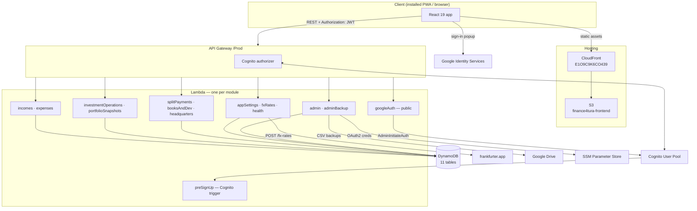
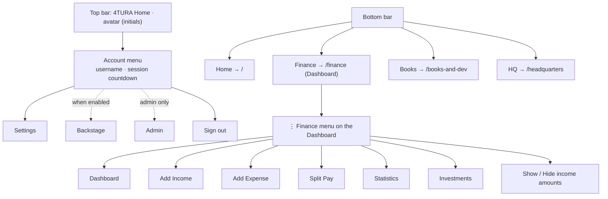
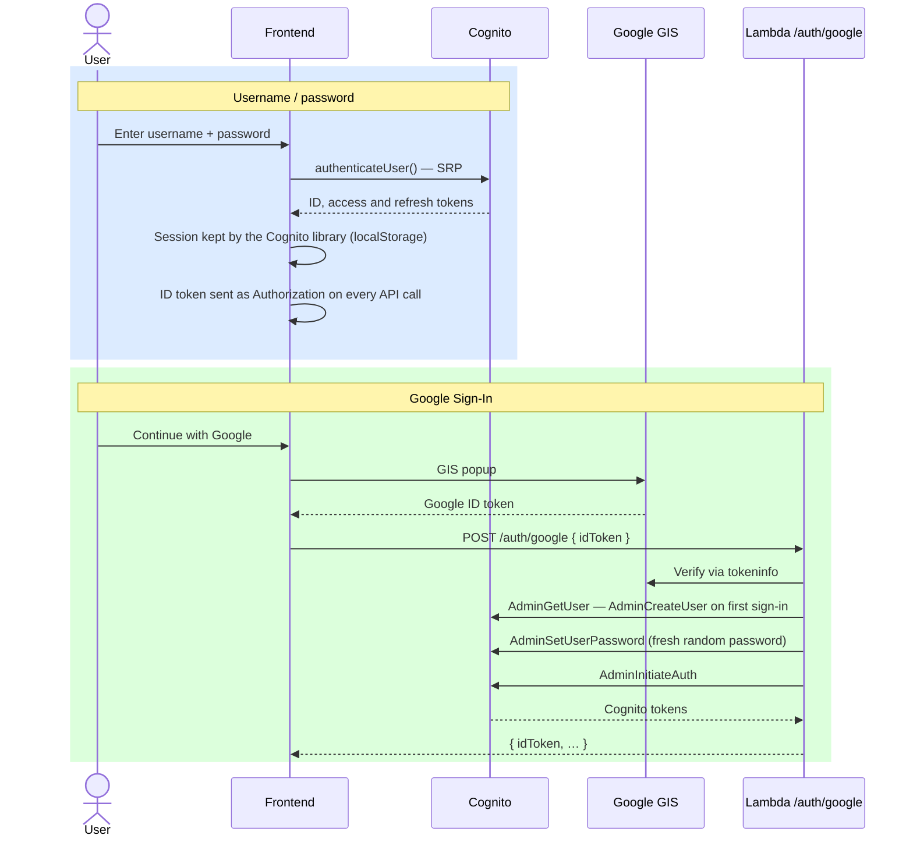
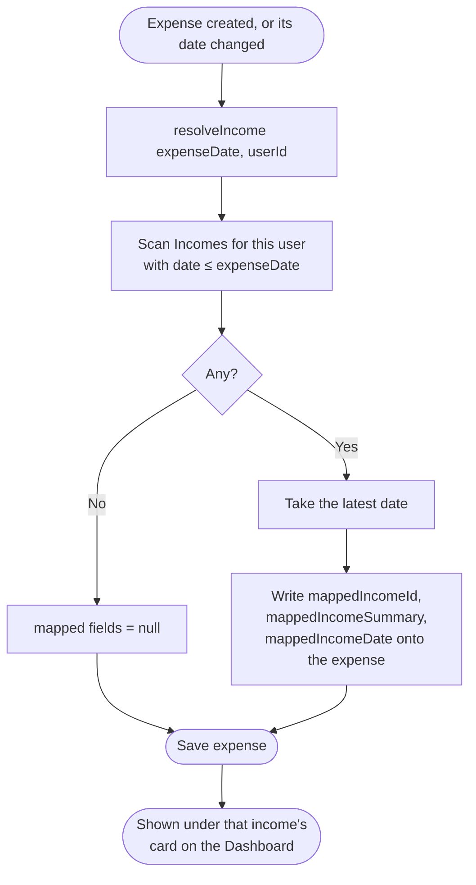
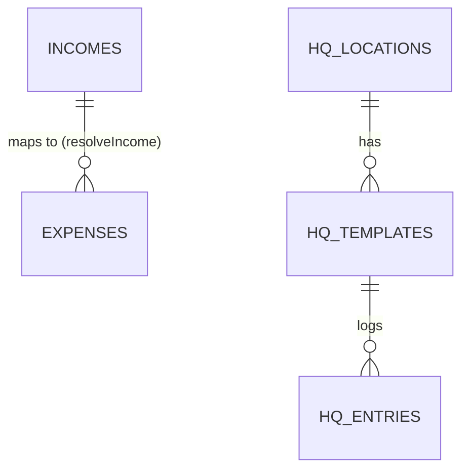

# 4TURA Home

> **Personal dashboard PWA** built around a budget: incomes arrive periodically, and every expense maps automatically to the most recent income before its date. Around it sit split payments, an investment portfolio, statistics, a reading log and home-utility tracking.

[](https://d34ylrmixnmvem.cloudfront.net)
[](https://2t55twyqmh.execute-api.eu-central-1.amazonaws.com/Prod/health)
[](https://nodejs.org)
[](https://react.dev)
[](https://web.dev/progressive-web-apps/)

**Production URL:** https://d34ylrmixnmvem.cloudfront.net

The repository, CloudFormation stack and S3 bucket keep the original name, **Finance4Tura**.

---

## Table of Contents

1. [Project Overview](#1-project-overview)
2. [Getting Started](#2-getting-started)
3. [Development Commands](#3-development-commands)
4. [System Architecture](#4-system-architecture)
5. [Navigation and Pages](#5-navigation-and-pages)
6. [Authentication Flow](#6-authentication-flow)
7. [Income Mapping Logic](#7-income-mapping-logic)
8. [Data Model](#8-data-model)
9. [API Reference](#9-api-reference)
10. [Environment Variables](#10-environment-variables)
11. [AWS Infrastructure](#11-aws-infrastructure)
12. [File Structure](#12-file-structure)
13. [Design Decisions](#13-design-decisions)
14. [Further Documentation](#14-further-documentation)

---

## 1. Project Overview

The core model is simple: **income defines a period, and every expense belongs to the period opened by the most recent income before it.**

### Core Concepts

| Concept | Description |
|---|---|
| **Income period** | Every income record opens a new budget period. Expenses between two income dates belong to the earlier income. |
| **Auto-mapping** | When an expense is created or its date changes, `resolveIncome` finds the latest income with `date <= expenseDate` and denormalizes its ID, summary and date onto the expense. |
| **Repeating events** | Incomes and expenses support daily/weekly/monthly recurrence. Occurrences are expanded into individual records at creation time, linked by a `seriesId`. |
| **Series editing** | Editing one occurrence sets `isException: true` on that record only. The `/series` endpoint updates all future occurrences. |
| **Special expenses** | `special: true` marks an expense with ★ and a red row background, and lists it in Statistics. |
| **One layout** | The app is mobile-only: every page is a centred phone-width column (430 px), on a phone or a laptop. |

### Modules

| Module | Route | What it does |
|---|---|---|
| Home Overview | `/` | This period's outstanding expenses, the last 3 open split payments, current holdings, latest book per person |
| Finance Dashboard | `/finance` | One income-period card at a time, swipeable, with its expenses and totals |
| Add Income / Add Expense | `/add-income`, `/add-expense` | Create and edit, including series |
| Split Payments | `/split-payments` | Payments split into instalments, tracked until settled |
| Statistics | `/statistics` | Monthly averages, free amount per month, special expenses |
| Investments | `/investments` | Portfolio across six platforms, in EUR, with history since 2023 |
| Books & Development | `/books-and-dev` | Reading and training log per person, with ratings |
| Headquarters | `/headquarters` | Meter readings per location, with water-consumption charts |
| Settings | `/settings` | Theme and income-amount privacy |
| Backstage | `/backstage` | Raw table viewer and a live API log (when enabled) |
| Admin | `/admin` | App settings, FX rates, backups, users (admin only) |

### Tech Stack

| Layer | Technology |
|---|---|
| Frontend | React 19, Vite, React Router, Recharts, Day.js, Axios, PWA (vite-plugin-pwa) |
| Backend | AWS SAM, Node.js 22, AWS Lambda |
| Database | AWS DynamoDB (on-demand) |
| Auth | AWS Cognito User Pool + Google Identity Services (GIS) |
| Hosting | S3 (frontend assets) + CloudFront |
| IaC | AWS SAM / CloudFormation (`backend/template.yaml`) |
| Tests | Vitest + Testing Library (frontend), `node --test` (backend) |

---

## 2. Getting Started

**There is no local backend.** DynamoDB Local and `sam local` were removed; the app runs against AWS only.

### Prerequisites

- Node.js 22+
- AWS CLI configured for account `980921747943`
- [AWS SAM CLI](https://docs.aws.amazon.com/serverless-application-model/latest/developerguide/install-sam-cli.html) (backend deploys only)

### Run the frontend

```bash
cd frontend
npm install
npm run dev    # http://localhost:5173 — talks to the deployed API
```

> ⚠️ A dev session uses the **production API and production data**. Anything you create, edit or delete is real.

Sign in with a Cognito username and password, or with **Continue with Google** when it's enabled in Admin → App Settings.

---

## 3. Development Commands

| Task | Command |
|---|---|
| Frontend dev server | `cd frontend && npm run dev` |
| Frontend tests | `cd frontend && npm test` |
| Lint frontend | `cd frontend && npm run lint` |
| Build frontend | `cd frontend && npm run build` |
| Backend tests | `cd backend && npm test` |
| Build backend | `cd backend && ulimit -n 10240 && sam build --no-cached` |
| Deploy backend | `cd backend && sam deploy` (after the build) |
| Deploy frontend | see below |

### Deploy the frontend

```bash
cd frontend && npm run build
aws s3 sync dist s3://finance4tura-frontend --region eu-central-1 --delete
aws cloudfront create-invalidation --distribution-id E1O9C9K6CO439 --paths "/*" --region us-east-1
```

When both change, deploy the backend first. Full details are in [`Documentation/AWS_Sync.md`](Documentation/AWS_Sync.md).

---

## 4. System Architecture


```mermaid
graph TB
    subgraph Client["Client (installed PWA / browser)"]
        B[React 19 app]
    end

    subgraph Edge["Hosting"]
        CF[CloudFront<br/>E1O9C9K6CO439]
        S3[S3<br/>finance4tura-frontend]
    end

    subgraph API["API Gateway /Prod"]
        AUTHZ[Cognito authorizer]
    end

    subgraph Lambdas["Lambda — one per module"]
        L1[incomes · expenses]
        L2[investmentOperations · portfolioSnapshots]
        L3[splitPayments · booksAndDev · headquarters]
        L4[appSettings · fxRates · health]
        L5[admin · adminBackup]
        L6[googleAuth — public]
        L7[preSignUp — Cognito trigger]
    end

    DDB[(DynamoDB<br/>11 tables)]
    COG[Cognito User Pool]
    GIS[Google Identity Services]
    FX[frankfurter.app]
    GD[Google Drive]
    SSM[SSM Parameter Store]

    B -->|static assets| CF --> S3
    B -->|"REST + Authorization: JWT"| API
    API --> AUTHZ --> COG
    API --> L1 & L2 & L3 & L4 & L5 & L6
    L1 & L2 & L3 & L4 & L5 --> DDB
    L6 -->|AdminInitiateAuth| COG
    COG --> L7
    L4 -->|POST /fx-rates| FX
    L5 -->|CSV backups| GD
    L5 -->|OAuth2 creds| SSM
    B -->|sign-in popup| GIS
```

---

## 5. Navigation and Pages


```mermaid
graph TD
    TOP["Top bar: 4TURA Home · avatar (initials)"]
    TOP --> MENU["Account menu<br/>username · session countdown"]
    MENU --> SET[Settings]
    MENU -. "when enabled" .-> BS[Backstage]
    MENU -. "admin only" .-> ADM[Admin]
    MENU --> OUT[Sign out]

    BAR["Bottom bar"] --> HOME["Home → /"]
    BAR --> FIN["Finance → /finance (Dashboard)"]
    BAR --> EVO["Books → /books-and-dev"]
    BAR --> HQ["HQ → /headquarters"]

    FIN --> FM["⋮ Finance menu on the Dashboard"]
    FM --> D[Dashboard] & AI[Add Income] & AE[Add Expense] & SP[Split Pay] & ST[Statistics] & INV[Investments] & PRIV[Show / Hide income amounts]
```

- **Bottom bar**: Home · Finance · Books · HQ. Every tab opens one page; Finance opens the Dashboard on the current income, and stays highlighted on all Finance pages.
- **Finance menu** (⋮ on the Dashboard header): Dashboard, Add Income, Add Expense, Split Pay, Statistics, Investments, then Show / Hide income amounts.
- **Avatar menu** (initials, top right): Settings, Admin and Sign out. Backstage appears between Settings and Admin while it's enabled in App Settings. Admin appears only for the admin user.
- Tapping an item, or any route change, closes the sheet or menu.

---

## 6. Authentication Flow


```mermaid
sequenceDiagram
    actor U as User
    participant F as Frontend
    participant C as Cognito
    participant G as Google GIS
    participant L as Lambda /auth/google

    rect rgb(220, 235, 255)
        Note over U,C: Username / password
        U->>F: Enter username + password
        F->>C: authenticateUser() — SRP
        C-->>F: ID, access and refresh tokens
        F->>F: Session kept by the Cognito library (localStorage)
        F->>F: ID token sent as Authorization on every API call
    end

    rect rgb(220, 255, 220)
        Note over U,L: Google Sign-In
        U->>F: Continue with Google
        F->>G: GIS popup
        G-->>F: Google ID token
        F->>L: POST /auth/google { idToken }
        L->>G: Verify via tokeninfo
        L->>C: AdminGetUser — AdminCreateUser on first sign-in
        L->>C: AdminSetUserPassword (fresh random password)
        L->>C: AdminInitiateAuth
        C-->>L: Cognito tokens
        L-->>F: { idToken, … }
    end
```

- New sign-ups are auto-confirmed by the Cognito pre-sign-up trigger.
- Sign-up and Google sign-in can each be switched off in Admin → App Settings.
- There is no token refresh: when the ID token expires, the next 401 signs the user out. The avatar menu shows the time left.
- Google users get a new random password on every sign-in, so no password can be derived or reused. See CLAUDE.md, "Google Sign-In credential design".

---

## 7. Income Mapping Logic


```mermaid
flowchart TD
    A([Expense created, or its date changed]) --> C[resolveIncome expenseDate, userId]
    C --> D[Scan Incomes for this user<br/>with date ≤ expenseDate]
    D --> E{Any?}
    E -- No --> F[mapped fields = null]
    E -- Yes --> G[Take the latest date]
    G --> H[Write mappedIncomeId,<br/>mappedIncomeSummary,<br/>mappedIncomeDate onto the expense]
    F --> I([Save expense])
    H --> I
    I --> J([Shown under that income's<br/>card on the Dashboard])
```

For a repeating expense, every occurrence is mapped on its own date. `scripts/remap-expenses.mjs` re-runs the mapping over every expense after bulk income changes.

---

## 8. Data Model

All tables use pay-per-request billing and a single string hash key. Per-user tables carry `userId` (the Cognito `sub`).

| Table | Key | Contents |
|---|---|---|
| `Incomes` | `incomeId` | summary, date, amount, currency, series fields. GSI `date-index` |
| `Expenses` | `expenseId` | as Incomes + priority, status, special, mapped-income fields. GSI `date-index` |
| `SplitPayments` | `splitPaymentId` | title, totalAmount, currency, occurrenceCount, occurrenceType, createdDate, occurrences |
| `InvestmentOperations` | `operationId` | date, type (Deposit/Withdrawal), platform, amount, currency, notes |
| `PortfolioSnapshots` | `snapshotId` | date, platform, amount, currency — one row per platform per reading |
| `Books_and_Dev` | `bookId` | name (person), type, source, author, title, dateCompleted (YYYY-MM), rating, comments |
| `HQ_Locations` | `hqId` | name, address, order |
| `HQ_Templates` | `templateId` | hqId, name, parameters (max 30) |
| `HQ_Entries` | `entryId` | templateId, hqId, date, values, notes |
| `AppSettings` | `settingKey` | one global item: backstageEnabled, googleLoginEnabled, createAccountEnabled |
| `FxRates` | `rateId` | one global item: the EUR/USD/RON rate matrix and updatedAt |


```mermaid
erDiagram
    INCOMES ||--o{ EXPENSES : "maps to (resolveIncome)"
    HQ_LOCATIONS ||--o{ HQ_TEMPLATES : has
    HQ_TEMPLATES ||--o{ HQ_ENTRIES : logs
```

**Field notes:**
- `repeatFrequency`: `daily` | `weekly` | `monthly`
- `priority`: `High` | `Medium` | `Low`; `status`: `Pending` | `Completed`
- `isException`: `true` when one series occurrence was edited on its own
- SplitPayments `occurrences`: `[{ index, value }]`, where `value` is an amount, a `YYYY-MM-DD` date, or `""`
- FxRates `rates[FROM][TO]` is the value of 1 `FROM` in `TO`

Full field lists are in [CLAUDE.md](CLAUDE.md#database-schema).

---

## 9. API Reference

**Base URL:** `https://2t55twyqmh.execute-api.eu-central-1.amazonaws.com/Prod`

Protected routes need `Authorization: <Cognito ID token>` (no `Bearer` prefix). Admin routes also need the caller to be in the Cognito `admin` group.

| Area | Routes | Auth |
|---|---|---|
| Auth | `POST /auth/google` | public |
| Health | `GET /health` | Cognito |
| Incomes | `POST /incomes` · `GET /incomes?from=&to=` · `GET/PUT/DELETE /incomes/{id}` · `PUT /incomes/{id}/series` · `DELETE …?deleteSeries=true` | Cognito |
| Expenses | as Incomes, plus `GET /expenses/resolve-income?date=` | Cognito |
| Investments | `GET/POST /investments/operations` · `PUT/DELETE /investments/operations/{id}` · `GET /investments/snapshots` · `GET /investments/snapshots/latest` · `POST /investments/snapshots` · `PUT/DELETE /investments/snapshots/{id}` | Cognito |
| Split Payments | `GET/POST /split-payments` · `PUT/DELETE /split-payments/{id}` | Cognito |
| Books & Dev | `GET/POST /books-and-dev` · `PUT/DELETE /books-and-dev/{id}` | Cognito |
| Headquarters | `GET/POST /headquarters` · `PUT/DELETE /headquarters/{hqId}` · same under `/headquarters/templates` and `/headquarters/entries` | Cognito |
| App Settings | `GET /app-settings` (public) · `PUT /app-settings` | admin for PUT |
| FX Rates | `GET /fx-rates` (public) · `POST /fx-rates` (refresh from frankfurter.app) | admin for POST |
| Admin users | `GET /admin/users` · `PUT /admin/users/{username}/role` · `DELETE /admin/users/{username}` | admin |
| Backups | `GET /admin/backup/preview` · `POST /admin/backup/prepare` · `POST /admin/backup/run-table` | admin |
| AI News | `GET /ai-news` | public — deployed but unused by the frontend |

Notable behaviour:
- `PUT /incomes/{id}` and `PUT /expenses/{id}` on a series member set `isException: true`.
- `PUT /expenses/{id}` re-runs income mapping when the date changes.
- Incomes and expenses with `amount <= 0` are rejected with 400.
- `DELETE /headquarters/{hqId}` returns 400 while the location still has templates.
- Every response carries `Cache-Control: no-store`.

---

## 10. Environment Variables

### Frontend

`frontend/.env.production` (and `.env.local` for `npm run dev`, which uses the same production values):

| Variable | Value |
|---|---|
| `VITE_API_BASE_URL` | `https://2t55twyqmh.execute-api.eu-central-1.amazonaws.com/Prod` |
| `VITE_COGNITO_USER_POOL_ID` | `eu-central-1_CD7AdBFwQ` |
| `VITE_COGNITO_CLIENT_ID` | `2nh5dljhrg9mq7nsmdg7cef21v` |
| `VITE_COGNITO_REGION` | `eu-central-1` |
| `VITE_GOOGLE_CLIENT_ID` | Google OAuth client ID |

> `vite.config.js` must keep `define: { global: 'globalThis' }` for `amazon-cognito-identity-js`.

### Backend

Set in `backend/template.yaml`:

| Variable | Used by | Notes |
|---|---|---|
| `*_TABLE` (11) | all handlers | Table names, set globally |
| `USER_POOL_ID`, `CLIENT_ID` | googleAuth, admin | Cognito pool and app client |
| `GOOGLE_CLIENT_ID` | googleAuth | From the `GoogleClientId` parameter in `samconfig.toml` |
| `GDRIVE_BACKUP_FOLDER_ID` | adminBackup | Parent Drive folder for backups |
| `ANTHROPIC_API_KEY` | getAiNews | Optional `AnthropicApiKey` parameter; blank by default |

The backup Lambda reads its Google Drive OAuth2 credentials from SSM at `/finance4tura/gdrive-oauth2`.

---

## 11. AWS Infrastructure

| Resource | Value |
|---|---|
| CloudFormation stack | `finance4tura-backend` |
| API Gateway URL | `https://2t55twyqmh.execute-api.eu-central-1.amazonaws.com/Prod` |
| S3 bucket (frontend) | `finance4tura-frontend` |
| CloudFront distribution | `E1O9C9K6CO439` — `d34ylrmixnmvem.cloudfront.net` |
| Cognito User Pool | `eu-central-1_CD7AdBFwQ` — app client `2nh5dljhrg9mq7nsmdg7cef21v`, group `admin` |
| AWS Region | `eu-central-1` |

The Cognito user pool is shared with the sibling **TYG** app (`../TYG`), which has its own stack. This stack owns the pool's pre-sign-up trigger.

---

## 12. File Structure

```
4TURAHome/
├── frontend/
│   ├── public/                       # App icons, PWA icons
│   ├── src/
│   │   ├── api/                      # One module per backend area + client.js (axios, auth header, opLog)
│   │   ├── components/
│   │   │   ├── Layout.jsx            # Passthrough to MobileLayout
│   │   │   ├── MobileLayout.jsx      # Top bar, avatar menu, bottom bar
│   │   │   ├── navConfig.js          # navGroups (tabs), financeItems (Dashboard menu), accountItems (avatar menu)
│   │   │   ├── TabIcons.jsx          # Flat colour bottom-bar icons
│   │   │   ├── navIcons.jsx          # Line icons for the Finance and account menus
│   │   │   ├── IncomeCard.jsx        # Income-period card on the Dashboard
│   │   │   ├── DateSheet.jsx         # App calendar sheet
│   │   │   ├── ui.jsx, tokens.js     # Shared primitives and token mirrors
│   │   │   ├── Field.jsx
│   │   │   └── ErrorBoundary.jsx
│   │   ├── context/                  # AuthContext, AppSettingsContext, YearContext
│   │   ├── pages/
│   │   │   ├── HomeOverview.jsx      # /
│   │   │   ├── Dashboard.jsx         # /finance
│   │   │   ├── AddIncome.jsx, AddExpense.jsx
│   │   │   ├── SplitPayment.jsx, Statistics.jsx, Investments.jsx
│   │   │   ├── BooksAndDev.jsx
│   │   │   ├── Headquarters/         # Tabs, entry table, modals
│   │   │   ├── Settings.jsx, Backstage.jsx, Admin.jsx, Login.jsx
│   │   │   └── *.test.jsx
│   │   ├── test/                     # Util and regression tests
│   │   ├── utils/colors.js           # The one file allowed raw hex
│   │   └── index.css                 # Design tokens and themes
│   ├── .env.production
│   └── vite.config.js
│
├── backend/
│   ├── template.yaml                 # SAM / CloudFormation stack
│   ├── samconfig.toml                # Deploy defaults
│   └── src/
│       ├── handlers/                 # One file per Lambda (+ *.test.mjs)
│       └── lib/                      # dynamo.mjs, expandDates.mjs (+ tests)
│
├── scripts/
│   ├── remap-expenses.mjs            # Re-map every expense to its income (cloud)
│   └── seed-*.mjs                    # Legacy — targeted DynamoDB Local
│
├── Documentation/                    # Deploy guides and module requirements
├── CLAUDE.md                         # Detailed architecture and conventions
└── README.md
```

---

## 13. Design Decisions

| Decision | Choice | Rationale |
|---|---|---|
| Recurring events | Expand to individual records at write time | No expansion logic on read; each record is independently editable. |
| Income mapping | Denormalized onto the expense | The Dashboard renders without joins; mapping is computed once at write time. |
| Series editing | Single edits set `isException`; `/series` updates future records | Past records stay untouched while bulk corrections stay possible. |
| One phone-width layout | The same 430 px column everywhere | Used mainly as an installed PWA; one layout removes the desktop/mobile divergence. |
| Navigation | Four content tabs; settings and admin in the avatar menu | Keeps the bar to destinations people visit daily. |
| AWS only | No local backend | One environment to keep correct. Dev sessions use production data. |
| Frontend hosting | S3 + CloudFront | Static site, HTTPS, CDN, no server. |
| Authentication | Cognito + GIS popup via a custom Lambda | Cognito handles JWTs; Google sign-in works without Hosted UI redirects. |
| Cache-Control | `no-store` on every response | Stops API Gateway's CloudFront layer serving stale per-user data. |
| FX rates | Stored once, refreshed by an admin | Pages never call a third party at load time. |
| Design tokens | All colours, radii, shadows, spacing and type as CSS variables | A test fails the build on raw values outside the token files. |

---

## 14. Further Documentation

| Document | Contents |
|---|---|
| [CLAUDE.md](CLAUDE.md) | Full architecture, per-module behaviour, schema, tests, conventions |
| [Documentation/AWS_Deploy.md](Documentation/AWS_Deploy.md) | How the AWS environment is built, for a rebuild from scratch |
| [Documentation/AWS_Sync.md](Documentation/AWS_Sync.md) | Day-to-day deploys, logs, rollbacks, Cognito admin |
| [Documentation/Frontend_Setup.md](Documentation/Frontend_Setup.md) | Frontend structure and conventions |
| [Documentation/Requirements.md](Documentation/Requirements.md) | Requirements by phase, kept current with the app |
| [Documentation/SplitPayment_Requirement.md](Documentation/SplitPayment_Requirement.md) | Split Payments |
| [Documentation/Investments_Requirement.md](Documentation/Investments_Requirement.md) | Investments |
| [Documentation/Headquarters_Requirements.md](Documentation/Headquarters_Requirements.md) | Headquarters |
| [Documentation/Backup_Requirements.md](Documentation/Backup_Requirements.md) | Admin database backup to Google Drive |
